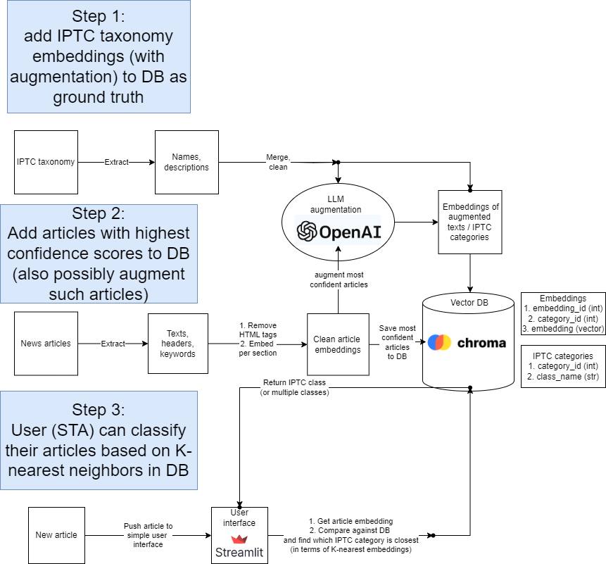

# NLP Project - IPTC News Categorization

## Task description

This project aims to categorize a collection of news articles in both Slovenian and English languages based on the IPTC taxonomy. The articles are coming from Slovenian Press Agency (STA) database. However, our solution is aimed to be versatile and universal, handling texts coming from different sources and possibly written in different languages.

## Taxonomy

The IPTC taxonomy is a hierarchical taxonomy of news categories. 

The original taxonomy has the following structure:

|   | Qcode         | IPTC NAME                       | STA EQUIVALENT       | TOPIC TRANSLATION           | IPTC DESCRIPTION                      | OPOMBE |
|--:|:--------------|:--------------------------------|:---------------------|:----------------------------|:--------------------------------------|:-------|
| 0 | subj:01000000 | arts, culture and entertainment | kultura (kategorija) | Umetnost, kultura in zabava | Matters pertaining to the...          | nan    |
| 1 | subj:01001000 | archaeology                     | arheologija          | arheologija                 | Probing the past through ruins and... | nan    |
| 2 | subj:01002000 | architecture                    | arhitektura          | arhitektura                 | Designing of buildings, monuments...  | nan    |

Where first 2 digits of `Qcode`, e.g. `"subj:01..."` represent the top level category, while the remaining digits represent the subcategories.

**We limit the scope of the IPTC taxonomy to only first two digits of `Qcode`**, in order to reduce complexity of the task and enable obtaining higher precision of categorization. 
This means that the testing procedure involves only top-level hierarchy. However, the lower two levels of IPTC hierarchy might also be inferred.

## Test Dataset

We create a test dataset using the following procedure:
1. Randomly select 300 news articles in english
2. Pseudo-label both datsets using the final soution described in the next section
3. Manually go over labels in both datasets and correct mistakes using our custom labeling app


## Solution

Our approach uses pretrained versatile language model embeddings to represent news articles:
1. We generate embeddings for all articles in the dataset, using a pretrained Large Language Model. 

    These sort of embeedings capture the semantic meaning of the whole text fragment and can be used in multilingual setting depending on the model.
    For the sake of fast prototyping, we decided to apply [OpenAI ADA Embeddings](https://platform.openai.com/docs/guides/embeddings), which are still considered state of the art across variety of NLP tasks according to results from 2023 paper [“MTEB: Massive text embedding benchmark”](https://arxiv.org/abs/2210.07316).

2. We generate embedding for each category name.

3. We calculate cosine similarity between each article and each category name. The category with the highest similarity is assigned to the article.


The solution was compared to open-source [AnglE](https://github.com/SeanLee97/AnglE) embeddings and both methods were evaluated on test dataset, present in `labeling_app/labeled_data.csv` folder.

| Metric \ Embedding  | Ada       | Angle     |
|---------------------|-----------|-----------|
| Accuracy            | 85.67%    | 64.00%    |
| F1 Score            | 80.40%    | 51.49%    |


## Solution extension 
We use language models to generate a set of extended descriptions for each category, based on the original name and description. Then we generate their embeddings and compare article embedding to extended description embeddings, instead of IPTC category name embeddings. Results of the extended solution are compared to the initial baseline.


## Final solution architecture

During the first phase of project we managed to develop a comprehensive and efficient solution for IPTC news categorization. However, our project still lacked:
1. Effective way of storing the embeddings and efficient querying results.
2. An easy-to-use application with the IPTC class assignment functionality.

The final phase of this project includes building such architecture. First of all, it will auto-improve by extending the embedding database with relevant input articles. Secondly, it will be accessible to external users, who will be granted the IPTC classification functionality.  



The key components of this architecture are:
1. **Vector Database**. The implementation of vector database is a key step in enhancing the performance and efficiency
of our model. This involves the establishment of
optimized database to store vector representations
of IPTC categories for quicker retrieval and pro-
cessing. Moreover the database could be extended
with news articles and their headlines, which are
classified on high confidence level and could en-
hance the quality of queries.
For now we deployed a local ChromaDB database.
2. **Quality Article Pre-processing**. Such processing would possibly improve the overall system quality, including: HTML tag removal, creating embeddings per article sections and incorporation of article headlines.
3. **Self-improvement system**. Our system would self-improve while receiving new articles for categorization. The articles which passed a certain threshold of similarity with IPTC category would be added to the vector database. Such process could possibly lead to improvement of the database querying system.
4. **Intuitive user interface**. For now, a prototype version of user interface is deployed, which allows to input an article text and assign the best matching IPTC categories from different levels of hierarchy. The goal is to improve the interface, so it provides easy-to-use and effective interface.


5. (optional) **Language-optimized approach**. We might consider an automatic language detection system and creation of separate vector databases in different languages (such as English and Slovenian), which would enhance the language-specific categorisation.

## Current project structure

```
.
├── README.md
├── requirements.txt
│
├── chroma <- Chroma vector database files, used for storage of embeddings.
├── data
│   ├── API_conn.ipynb <- data collection from STA API
│   ├── 2023_articles_en <- raw articles in english
│   ├── 2023_articles_sk <- raw articles in slovenian
│   ├── taxonomy 
│   │   ├── TAKSONOMIJA.xlsx <- original taxonomy provided by STA
│   │   ├── taxonomy.csv <- processed taxonomy
│   │   ├── taxonomy_expanded.csv <- taxonomy expanded with embeddings for extended descriptions of categories
│   │   └── taxonomy_chroma.csv <- processed taxonomy for migration to Chroma vector database
│   └── test_sets <- test datasets
│
├── notebooks
│   ├── 00_taxonomy_processing.ipynb <- process taxonomy, add embeddings to taxonomy 
│   ├── 01_articles_EDA.ipynb <- initial exploration of STA dataset
│   ├── 02_generate_test_datasets.ipynb <- test dataset creation
│   ├── 03_generate_predictions.ipynb <- generate initial predictions for articles with Ada and AnglE embeddings
│   ├── 04_predictions_EDA.ipynb <- exploration of initial results, including IPTC categories distribution, embedding visualizations and confusion matrices
│   ├── 05_category_descriptions.ipynb <- extension of category descriptions in IPTC category
│   ├── 06_benchmark.ipynb <- comparison of classification quality for different variants of IPTC category representations
│   └── 07_migrate_to_vector_database.ipynb <- migration of embeddings to ChromaDB vector database
│
├── labeling_app <- contains an app to label news articles, developed by our team, along with labeled test set inside labeled_data.csv
├── prompts <- LLM prompts used for IPTC category expansion
├── resources <- additional resources e.g. images
├── results <- results of our classification benchmark
├── src <- various classes and modules used across different notebooks. Including classes used for creating vector embeddings and classes used in EDA for visualizations.
│
└── ui <- prototype of user interface to our application
```

In the code for public repository, `notebooks/01_articles_EDA.ipynb` and `data` folder are removed due to NDA.